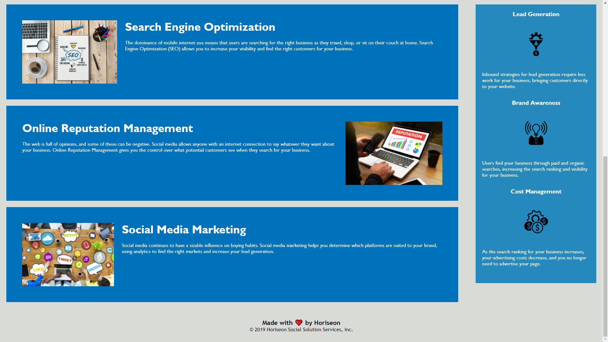

# Optimizing the SEO

## Description

For this project I was tasked with optimizing pre-existing code while maintaining the integrity and functionality of the website. The changes made were entirely up to me.

## "Them Changes"

The following is a list of various changes made to the original code. Some minor changes may not be mentioned due to them being included in bigger changes.
    
-Added Semantic elements throughout the HTML in order to improve readability and ease of navigation through the code
-Fixed faulty links at the top of the page
-Added a title
-Greatly improved the formatting throughout the HTML
-Added alt text to all images to improve accessability
-Changed various id and class tags throughout the HTML in order to allow for consolidating of the CSS
-Greatly improved the efficiency of the CSS by consolidating whenever possible and correcting element/class/id tags when neccessary
-Changed the layout of the CSS in order to follow best practices
-Some smaller changes may not be mentioned due to their inclusion in the previously mentioned changes

## Links

[Github Repository](https://github.com/JGuerrero126/Optimizing-The-SEO)

[The Website](https://jguerrero126.github.io/Optimizing-The-SEO/)

## Images/Screenshots

